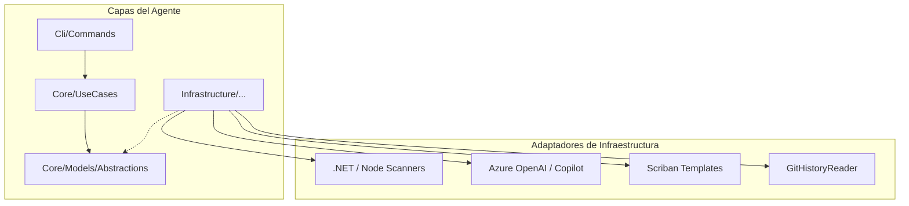

# DocGen-Agent CLI 🤖📝

[](https://dotnet.microsoft.com/download/dotnet/10.0)
[-orange.svg)](https://github.com/rubendario921/docgen-agent-cli)
[](https://github.com/rubendario921/docgen-agent-cli)

Agente inteligente CLI diseñado para la generación automatizada de documentación técnica de alta calidad. Utiliza **Arquitectura Hexagonal**, **IA (Azure OpenAI / GitHub Copilot)** y análisis estático para transformar código fuente en documentación estándar y profesional.

---

## 🚀 Objetivo Principal

Implementar un **pipeline manual y reutilizable** que genere documentación técnica en Markdown para repositorios .NET y Node.js. El agente automatiza el análisis, renderizado y publicación (Wiki y `/docs`), asegurando consistencia y trazabilidad.

### ✨ Características Clave

- 🔍 **Análisis Estático**: Detección de controladores, endpoints, servicios, DTOs y módulos.
- 🤖 **IA Multi-Provider**: Generación de descripciones semánticas usando Azure OpenAI o GitHub Copilot.
- 📊 **Diagramas Automáticos**: Creación de diagramas de secuencia Mermaid basados en el flujo de código.
- 🕐 **Git Integration**: Inclusión de historial de cambios y trazabilidad de autores.
- 🏗️ **Multi-Stack**: Soporte para .NET (ASP.NET Core) y Node.js (NestJS/Express).

---

## 🏗️ Arquitectura (Hexagonal)

El proyecto sigue los principios de **Clean Code** y **SOLID**, separando estrictamente la lógica de negocio de la infraestructura.



---

## 🛠️ Configuración y Desarrollo

### Recomendado: DevContainers

Para un entorno listo para usar sin instalar dependencias locales:

1. Asegúrate de tener **Docker** y la extensión **Dev Containers** en VS Code.
2. Abre el proyecto y selecciona **"Reopen in Container"**.
   - *Incluye SDK 10, Git y extensiones recomendadas.*

### Docker (Producción / Ejecución)

Si deseas construir y ejecutar el agente de forma aislada:

**Build:**

```bash
docker build -t docgen-agent .
```

**Run (Escanear proyecto externo):**

```bash
docker run --rm \
  -v /ruta/al/proyecto:/src \
  -e AZURE_OPENAI_KEY="tu_key" \
  docgen-agent scan --solution "/src" --out "/src/docs/graph.json"
```

---

## 💻 Uso del CLI

El agente expone comandos específicos para cada etapa del proceso:

| Comando | Acción |
| :--- | :--- |
| `docgen scan` | Analiza el código y genera un `graph.json` con la estructura detectada. |
| `docgen render` | Toma el grafo y plantillas para generar el `techdoc.md`. |
| `docgen publish` | (Fase 2+) Publica la documentación en Azure DevOps Wiki. |

### Variables de Entorno (Secrets)

Crea un archivo `.env` o configúralas en tu pipeline:

- `AZURE_OPENAI_KEY`: Acceso al servicio de IA.
- `AZURE_OPENAI_ENDPOINT`: Endpoint de tu instancia de Azure.
- `SYSTEM_ACCESSTOKEN`: Token para integración con Azure DevOps.

---

## 📁 Estructura del Proyecto

```text
docgen-agent-cli/
├── Cli/            # Orquestación y comandos (System.CommandLine)
├── Core/           # Dominio y Abstracciones (Lógica pura)
├── Infrastructure/ # Implementaciones concretas (IO, Scanners, AI, Git)
├── Templates/      # Plantillas Scriban (*.sbn)
├── Rules/          # Prompts y reglas de taxonomía
├── DocGen-Agent.sln
└── Dockerfile      # Configuración de containerización
```

---

## 📜 Estándares de Codificación

1. **Hexagonal Architecture**: Ninguna clase del `Core` debe depender de la `Infrastructure`.
2. **SOLID**: Preferir interfaces y Dependency Injection.
3. **No 'any'**: Tipado estricto en todos los niveles.
4. **Unit Testing**: La lógica compleja debe ser testeable e inyectable.

---

**Autor:** Ruben Dario Carrillo
